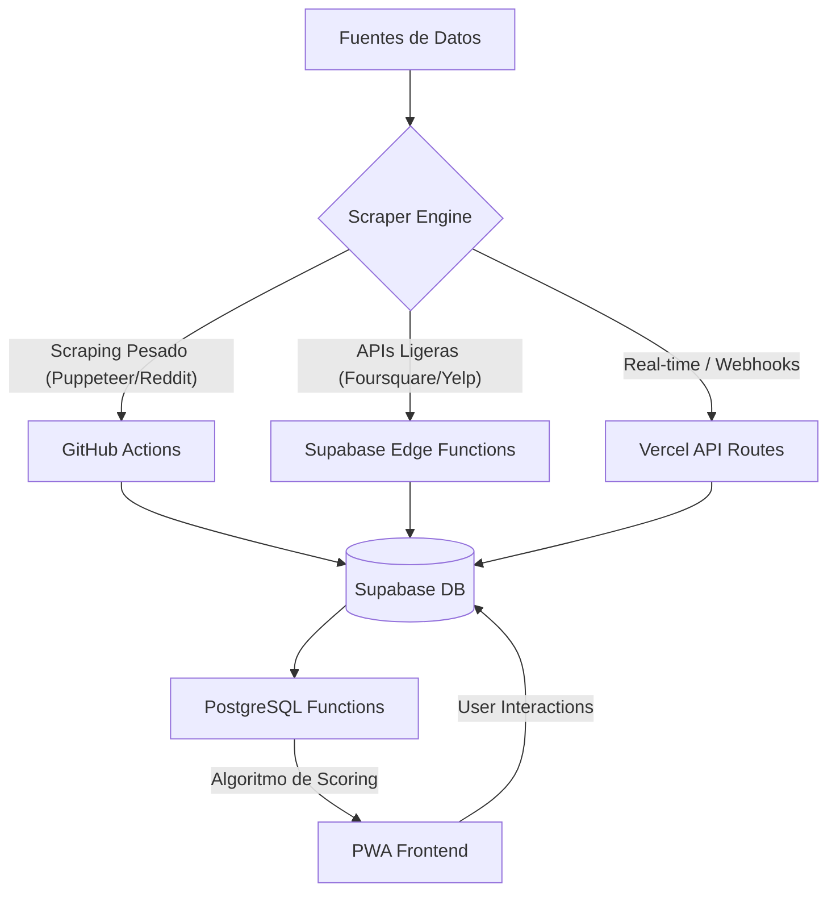

# ANALISIS TÉCNICO - PROYECTO VENUZ: "EL OJO DE DIOS"

## 1. ESTADO ACTUAL
### Auditoría del Código
*   **Scrapers**: Actualmente distribuidos entre dos repositorios de workflows. El sistema es **funcional pero fragmentado**. Se usa `ts-node` en GitHub Actions, lo cual es correcto para escalabilidad inicial, pero carece de un sistema de "retry" robusto.
*   **Base de Datos**: El schema es sólido para contenido básico, pero **insuficiente** para la visión de agregador masivo. Faltan campos de metadatos críticos (precios, horarios detallados, IDs externos).
*   **Feed**: Implementación básica de 50 items. **No hay paginación real ni personalización**. Carga todo el contenido flat, lo que causará lag en >1,000 registros.
*   **Interacciones**: El sistema de Likes/Saves via RPC es excelente. Es la base perfecta para el algoritmo de personalización.

## 2. ARQUITECTURA PROPUESTA: "THE HYBRID ENGINE"
Recomiendo la **OPCIÓN D (Híbrido)** por eficiencia de costos y rendimiento.



### Justificación:
*   **GitHub Actions**: Gratis para repos públicos (2,000 mins/mes). Ideal para procesos de 5-10 mins.
*   **Edge Functions**: Resuelven el problema de "Cold Starts" y están junto a los datos.
*   **Vercel**: Solo para la lógica de presentación y caching de UI.

## 3. SCHEMA DE BASE DE DATOS ACTUALIZADO
```sql
-- 1. Extensiones necesarias
CREATE EXTENSION IF NOT EXISTS "vector";

-- 2. Mejoras en la tabla Content
ALTER TABLE content 
ADD COLUMN IF NOT EXISTS min_price NUMERIC,
ADD COLUMN IF NOT EXISTS max_price NUMERIC,
ADD COLUMN IF NOT EXISTS price_level INTEGER, -- 1-4 ($ to $$$$)
ADD COLUMN IF NOT EXISTS rating NUMERIC,
ADD COLUMN IF NOT EXISTS reviews_count INTEGER,
ADD COLUMN IF NOT EXISTS external_ids JSONB, -- {foursquare: '...', yelp: '...'}
ADD COLUMN IF NOT EXISTS metadata JSONB,     -- {target_profiles: ['mochilero'], age_range: '20-35'}
ADD COLUMN IF NOT EXISTS embedding vector(1536); -- Para búsqueda semántica futura

-- 3. Tabla de Perfiles de Usuario (Personalización)
CREATE TABLE user_profiles (
  user_id UUID REFERENCES auth.users(id) PRIMARY KEY,
  affinities JSONB DEFAULT '{"nightlife": 0, "food": 0, "culture": 0}',
  price_preference INTEGER DEFAULT 2, -- Nivel de precio promedio
  last_active TIMESTAMP WITH TIME ZONE DEFAULT NOW()
);

-- 4. Índices Críticos
CREATE INDEX idx_content_category_active ON content(category_id, active);
CREATE INDEX idx_content_price_level ON content(price_level) WHERE price_level IS NOT NULL;
CREATE INDEX idx_content_geo ON content USING GIST (
  ll_to_earth(latitude, longitude)
);
```

## 4. PLAN DE IMPLEMENTACIÓN PRIORIZADO
### Semana 1: Cimientos y APIs de Volumen
*   Setup de Foursquare API (Nightlife/Bares).
*   Actualización de Schema en Supabase.
*   Migración del Scraper de Telegram para incluir @metadatos.

### Semana 2: Diversificación (El Ojo se abre)
*   Integración Yelp Fusion (Reviews/Ratings).
*   Scraper de Reddit (r/puertovallarta) para "Tips de Seguridad".
*   Implementación de Cursor-based Pagination en el Feed.

### Semana 3: Personalización y Algoritmo
*   Lógica de "Affinities" basada en Likes.
*   Creación de la función `get_personalized_feed` en SQL.
*   Integración Eventbrite (Tempo Real).

### Semana 4: Monetización y Pulido
*   Sistema de tracking de Affiliate Links.
*   Dashboard de "Featured Listings".
*   Optimización de carga de imágenes (WebP + CDN).

## 5. ESTIMACIÓN DE COSTOS (Low-Cost Focus)
| Servicio | Costo Estm. | Notas |
| :--- | :--- | :--- |
| **Supabase Pro** | $25/mes | Necesario para backups y mayor volumen de datos. |
| **Foursquare/Yelp** | $0/mes | Cubierto por sus Free Tiers generosos. |
| **Vercel Hobby** | $0/mes | Suficiente para el inicio. |
| **Proxies (Scraping)** | ~$15/mes | Para evitar bloqueos en Reddit/Instagram. |
| **TOTAL** | **~$40/mes** | **Meta cumplida (<$100)** |

## 6. RIESGOS Y RECOMENDACIONES
*   **Rate Limits**: Yelp es estricto (5k/día). Debemos cachear resultados agresivamente.
*   **Calidad de Datos**: El scraping de Reddit es ruidoso. Necesitaremos un filtro de palabras clave.
*   **Performance**: Con 500k posts, las queries espaciales (Nearby) pueden ser lentas sin `PostGIS`. Recomiendo activar la extensión si el volumen crece.

## 7. RESPUESTA FINAL
**¿Es viable construir este "Ojo de Dios" en 30 días?**
**SÍ**, pero bajo una condición: **Camino Crítico.**
Debemos enfocarnos primero en la **Ingesta Automática** (Foursquare/Yelp) y la **Paginación**. La personalización avanzada (IA/Embeddings) debe ser la última fase. Si logramos que el pipeline de datos fluya solo en la primera semana, el resto es UI y pulido.

---
🚀 **¡Listos para activar el Ojo de Dios!**
